# 图像分类

knn分类（k-邻近分类）：计算前k个最近（设计距离算法）的样本，根据权重归类。

线性分类 ： 权重W 乘以图像数据x  得到不同分类的得分，从而分类

​		训练集 验证集 测试集

**交叉检验**：

交叉检验通常不会将所有的训练集进行检验，抽取检验的数据，将训练集多次分成训练集和验证集，然后交叉检验

# 线性分类器的损失函数及优化

线性分类器中的参数称为超参数

svm损失函数和softmax损失函数对比：

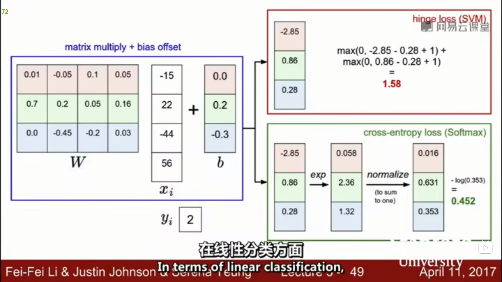

根据损失函数的梯度变化修正W值从而训练出更好的分类器

**正则化**：防止模型过拟合，因为要让AI模型不过于信赖样本数据。dropout

	特征提取：线性分类并不能适用于无法线性区分的数据集，因此可以将数据进行特征提取并整合，然后再作为分类器的输入。

	​方向梯度直方图（Histogram of Oriented Gradients  HoG）：测量图像中边缘的局部方向

**雅各比矩阵** ，当输入n维向量x经过f(x)变化生成了n维的输出向量y，雅各比矩阵每一行代表y的每个元素对于x每个元素的偏导数，因此雅各比矩阵为n*n矩阵

**下图中W的雅各比矩阵（红色）貌似不太对，应该转置过**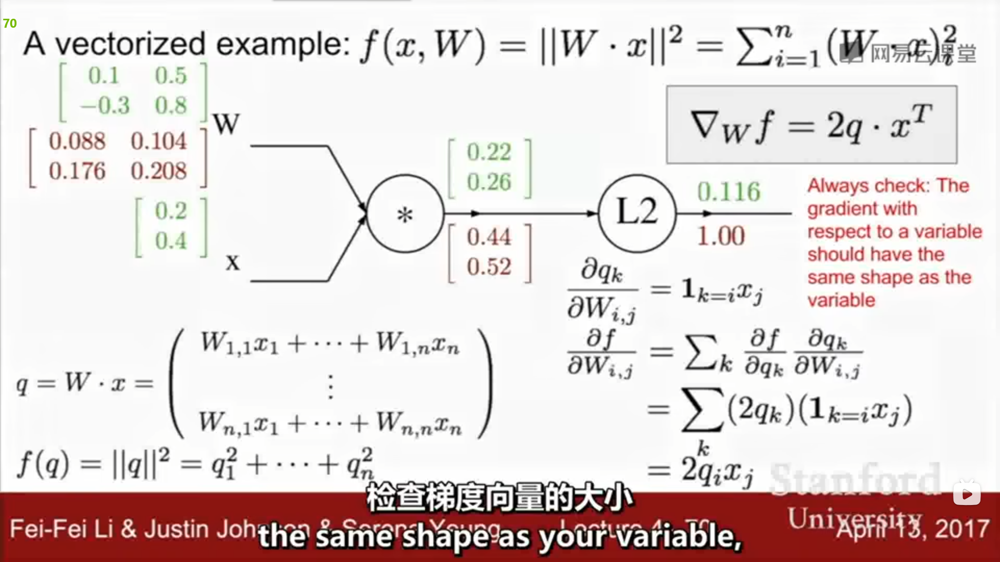

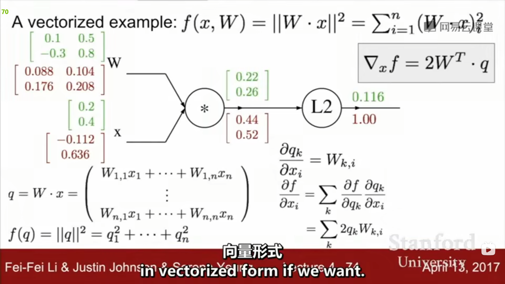

# 神经网络：	由线性变化和非线性变化不断排列组合形成的网络

​	重点：正向计算和反向计算，通过节点图去计算函数对于不同变量的梯度，以及多元函数、复合函数、向量情况下的梯度计算方法。（主要运用链式传递的关系进行偏导计算）

# 卷积神经网络

​	一、全连接层：顾名思义，将图像（例如32\*32\*3）中的3072个元素全部连接成一个向量，然后进行后续操作。（在卷积神经网络中会在卷积层和池化层处理的最后使用全连接层进行内容的汇总）

​	二、卷积层：使用一个或多个卷积核对图像进行卷积操作，生成一个与原图像形式一致的数据。卷积核的定义。输出的深度等于卷积核的个数。是否进行零填充（目的是确保数据的边缘和角落也可以进行卷积处理，同时也能确保输出和输入的大小一致）

	感受野：在卷积神经网络中，感受野（Receptive Field）的定义是卷积神经网络每一层输出的特征图（feature map）上的像素点在输入图片上映射的区域大小。再通俗点的解释是，特征图上的一个点对应输入图上的区域。

​	三、池化层：确保生成的表示更小且更容易控制，从而减少参数数量，对平面进行池化而非在深度方向上池化，池化过程也可以用卷积核计算，此时步长应当等于卷积核宽度，不再重复对一个区域进行计算，使得池化后的结果可以用一个数值表示一个区域。（考虑增加卷积层步长进行降采样，从而无需池化？）   使用最大池化往往会比平均值池化好  		

​		

## 	训练卷积神经网络

​激活函数：tanh、RELU、sigmoid ，引入激活函数是为了增加神经网络模型的非线性。

	如果不用激活函数，每一层输出都是上层输入的线性函数，无论神经网络有多少层，输出都是输入的线性组合，这种情况就是最原始的感知机(Perceptron)。这种情况无论有多少层神经网络均可以仅使用输入层和输出层代替，不同的地方就是线性函数的系数不同。激活函数给神经元引入了非线性因素，使得神经网络可以任意逼近任何非线性函数，这样神经网络就可以应用到众多的非线性模型中。
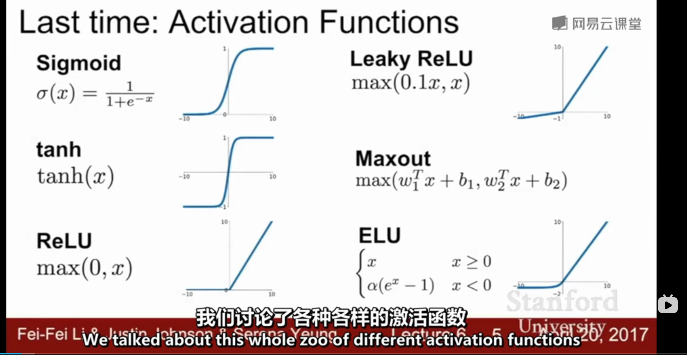

​数据预处理：中心化、归一化使其数据分布均值为0，方差为1

​权重选择，权重小可能会导致激活函数的值消失（不断乘以w），以至于网络崩溃，权重大会过饱和（因为激活值太大）  可以采用xavier初始化

​批量归一化：将数据转换为单位高斯数据（？）。常用于全连接层后和卷积层后，在激活函数之前（），并且必要时在归一化之后进行缩放和平移操作，可以将其看成一种正则化

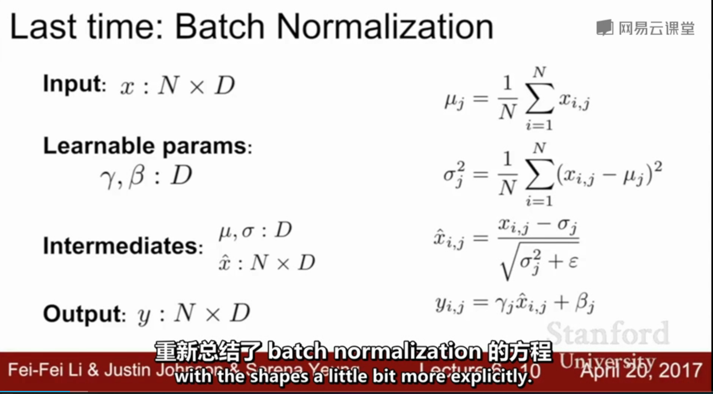

​监督训练卷积神经网络步骤：

**​数据预处理——选择架构——初始化网络参数（超参数随机采样）观察损失函数（增加正则化）——训练，从小数据集开始（关闭正则化）——正式训练，所有训练集，开启正则项，选择学习率**

	​epoch: 一个epoch , 表示所有的数据送入网络中， 完成了一次前向计算 + [反向传播](https://so.csdn.net/so/search?q=反向传播&spm=1001.2101.3001.7020) 的过程。随着epoch 数量的增加， 权重更新迭代的次数增多， 曲线从最开始的不拟合状态， 进入优化拟合状态， 最终进入过拟合。

​训练卷积神经网络的优化：

	​		SGD:随机梯度下降，stochastic gradient descent
	
	​		√ 带有动量的SGD，能够减少鞍点带来的影响，并且增加效率

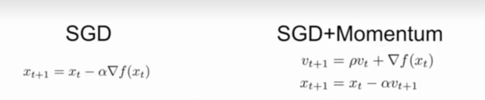

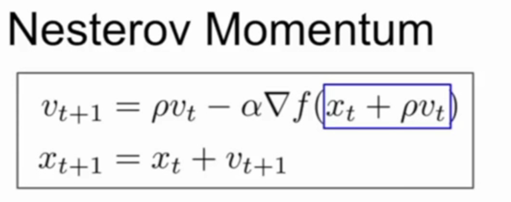

### 最优化方法：adam，包括参数的设计

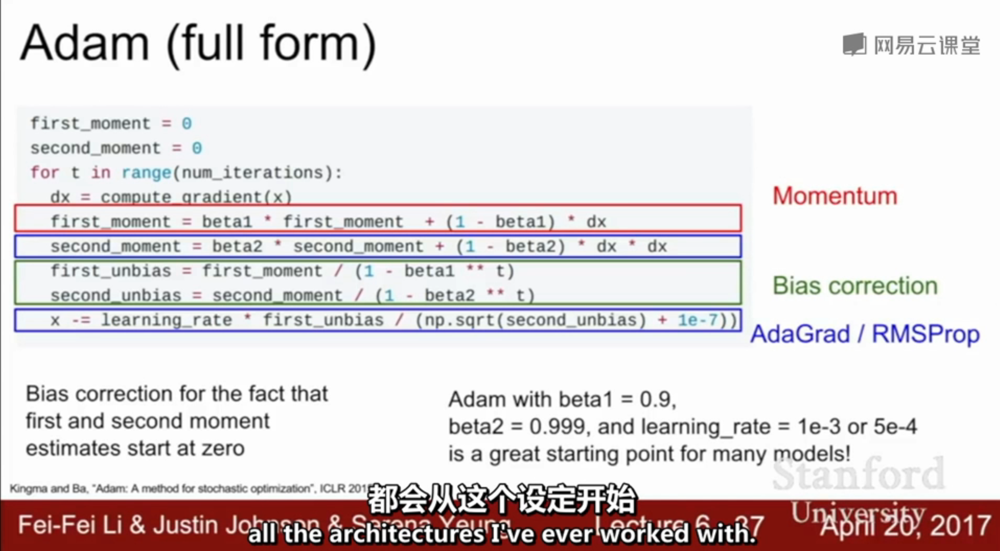

### 迁移学习

# 深度学习软件

	* tensorflow : 适用于所有层面，但是没有动态图
	* pytorch : 适用于科研
	* caffe	: 适用于产品
  

# CNN架构

	1. AlexNet
	2. VGGNet
	3. GoogleNet
   

# RNN 循环神经网络

序列输入输出，单个或多个输入，单个或多个输出。

不断更新隐藏态h。

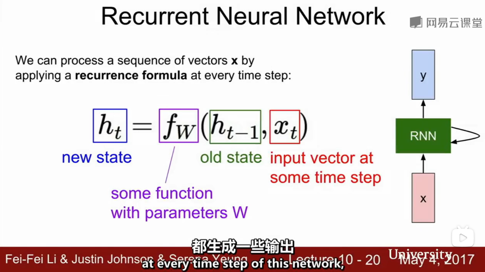

---

多对多情况下的模型，其他情况进行类似的操作。

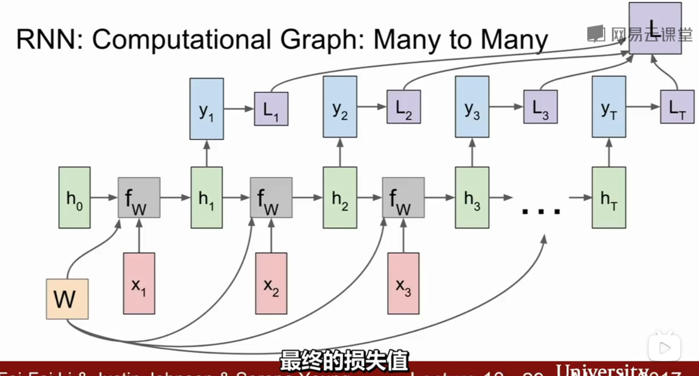

常见的RNN：语义，字符串的生成，例如生成图像的描述语句等。

（增加Attention，即注意力在进行隐藏态更新，随着递归进行注意力的变化）

LSTM:用于解决反向传递时出现的梯度爆炸和梯度消失。因为会多次将W因子相乘，当小于1时会趋向于0，大于1时趋向无穷大。

# 识别和分割

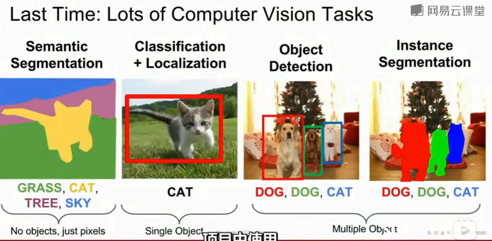	

	* 识别：对于包含多个对象的图像，围绕对象划定一个框并预测该对象从属的类别。可以使用滑动窗口的思想，但是不可穷举所有窗口，应当先使用对应算法选取一定数目的窗口，在进行判定为某个东西或背景。

	* 分割：对于给定图像，预测出每个位置以及图像该位置的物体的类别，着重于哪些像素属于这个物体。对于每一个框预测出分割区域，类似于微型的语义分割

**图像语义分割** ： 为图像的每一个像素产生分类类标。  但是语义分割不能区分同类目标，发生重叠时会判定为同一个

	* 滑动窗口：对于每个像素分别判定所属类别。复杂度高
	* 全连接卷积网络：
		去池化（上采样，过采样）：与池化过程相反，可以复制原值，也可以根据最大池化的原理进行去池化。目的是增加特征值尺度，进行更细致的划分（例如划分像素区域）

		转置卷积（去卷积，但是并没有进行卷积）：进行去池化的一种方式，使用输入作为权值，乘以卷积核，在输出的重叠部分进行叠加，从而实现过采样
	
	
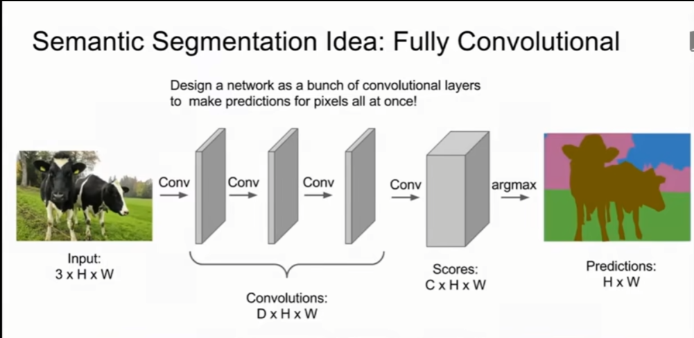	

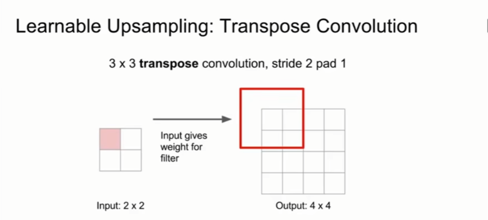
	

# 可视化

对中间神经元进行可视化理解

这是一项受到争议的方向，对于黑盒过程的神经网络，我们想知道具体的步骤和实现，希望能在可视化看到神经元的状态和图像信息。方便从人类角度去理解网络分类的问题机制和方法。

	激活值：进行卷积层之后的数据。

# 生成式模型

无监督学习的一种。

	监督学习和无监督学习： 有监督学习方法必须要有训练集与测试样本。在训练集中找规律，而对测试样本使用这种规律。而非监督学习没有训练集，只有一组数据，在该组数据集内寻找规律，即（聚类，clustering）。

三种生成式模型：

	* pixelRNNs & pixelCNN
	* Variational Autoencoders （VAE）
	* Generative Adversarial Networks （GAN） 生成式对抗网络
	

# 强化学习（深度增强学习）

	* Markov Decision Processes
	* Q-Learning
	* Policy Gradients

# 深度学习高效方法和硬件 以及 对抗样本和训练

PPT内容：

问题 动机 方法 为什么提出这样的方法