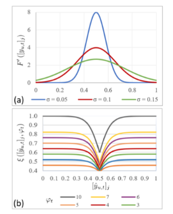

# G2NetPL Generic Game-Theoretic Network for Partial-Label Image Classification

偏标记训练图像数据：

1、full-set-single-positive-label (FSPL) :它要求为每个训练图像只标注一个正标签。虽然这些偏标签设置可以减轻注释负担，但仍然需要标记所有训练图像。

2、subset-singlepositive-label (SSPL)：只需要标记全部训练图像的一个子集，并且对于每个标记的图像，只注释一个正标签。

一方面，现有的基于标签相关性和标签矩阵补全的PLL方法不能同时处理单个正标签和未标记数据，不适用于SSPL;另一方面，虽然半监督学习可以处理无标记的图像，但它通常是基于有一个全标记训练图像子集的假设来设计的，并不专门用于不提供这样一个子集的SSPL。

***
***

**本文提出了一种新的通用博弈论网络(G2NetPL)，用于SSPL条件下多标签分类器的端到端训练。**

在G2NetPL中，每个未观察到的标签都与一个软伪标签相关联，该标签参与在一个双方非零和非合作的博弈，其目标是收敛到1(正)或0(负)，并在与网络确定的预测标签产生偏离时进行惩罚。网络作为第二参与人，在给定伪标签的情况下最小化加权损失函数。

在这个博弈理论框架中，网络和伪标签这两个参与者以不同的目标进行更新。从博弈论的观点来看，该网络可以实现对于伪标签估计中的误差的稳健性。同时，纳什均衡的存在将保证训练的收敛。

## 相关工作

1、偏标签：
    G2NetPL 可以预测收敛性和最优性

    大多数半监督模型仅关注单标签分类问题。为了适应多标签分类，需要进行修改；其他相关工作利用标签排名和标签相关性从正数据和未标记数据中学习，这些方法要求每张图像不止一个正标签，以便可以利用成对的标签依赖性。

2、FSPL

    该模型利用在线标签估计器联合训练图像分类器和标签估计器。在线估计需要将所有训练数据的完整标签存储在内存中。此外，标签估计器是随机初始化的，这导致端到端设置的模型较差，观察到的和未观察到的标签以相等的权重寻址。
    G2NetPL定义了网络和伪标签之间的博弈，每个博弈都有自己的目标。此外，置信度的引入在网络的损失函数中对未观察到的标签放置不同的权重，可以在不过度自信的情况下，逐渐将学习从观察到的标签转移到未观察到的标签。此外，G2NetPL在每个小批处理中学习图像的伪标签，而不需要将所有训练数据保存在内存中。

3、SSPL

    目前还没有明确探索SSPL对多标签图像分类的深入研究。通过必要的修改，一些半监督学习算法可以在此设置下工作

## $G^2NetPL$ 框架

令 $\mathcal I$ 是所有训练图像的集合，$\mathcal D $ 是 $\mathcal I$ 的子集，其中每个元素都有一个正标签，$\mathcal I \setminus \mathcal D$ 中的图像没有标记，设 $y^i_o $是 L 维的标签，其中图像 $i \in \mathcal D$，L 为总类数。

$y^i_o $的第$j$个元素可以是1或者0，分别表示第$j$类是被观察为正标签还是未标记的。$f(i,\theta_t)$ 分类器将图像$i$ 映射到预测的标签向量 $\hat y^i_t  \in  [0,1]^L ， i.e. \hat y^i_t = f(i,\theta_t)$ ，$\theta_t$ 表示在训练期间在时期 $t$ 得到的网络参数。用$\hat y ^i _{u,t} \in [0,1]^L$来表征图像 $i\in \mathcal L$ 在时期 $t$ 的软伪标签向量。文章删除索引 $i$ 以简化符号。

* 交叉熵损失：两个标量 $p,q \in [0,1]$ ，交叉熵损失函数定义为： $$\mathcal L(p,q) = -p \log(q) - (1-p)\log(1-q)$$

* 用 $[v]_j$表示$v$ 的第 $j$ 个条目。$v \in \mathbb R^L$

***

如图时$G^2NetPL$的模型，包含博弈的三个基本元素：

1、一组玩家（伪标签和网络）

2、一组玩家的策略或行动（$y_u$ 表示伪标签，$\theta $ 表示网络），

3、以及相关成本（$\mathcal L_{ACE}$ 和 $\mathcal L_{G^2NetPL}$）。

在我们的博弈中，每个玩家的收益由策略决定。

网络的目标是最小化损失函数 $\mathcal L_{G^2NetPL}$（$y_u$ 通过调度器 $\xi$ 影响$\mathcal L_{G^2NetPL}$），而伪标签的目标是收敛到 1 或 0，但会偏离网络生成的预测标签（$\theta$ 通过预测的标签影响 $L_{CE}$）。

**纳什均衡** 使得双方都没有动力去改变当前的策略。在训练过程中，$\mathcal I$ 中每个图像的伪标签向量 $ \hat y_{u,0}$ 将被初始化为 1 用于已观测的标签，未观察到的标签为无偏概率 0.5，这意味着与 1（正）和 0（负）的距离相等。基于接收到的 $ \hat y_{u,t}$ ，网络更新其参数 $\theta_t$ 以最小化损失函数 $\mathcal L_{G^2NetPL}$。

一旦确定了 $\theta_t$ ，通过该网络预测标签 $\hat y_t$ ，使用最小化交叉熵损失函数 $L_{ACE}$ 去迭代伪标签 $ \hat y_{u,t+1}$ 。重复这个过程，直到网络参数和伪标签都收敛到**纳什均衡**，这提供了学习的鲁棒性。在测试期间，只有主干和分类器将用于预测标签。

## 伪标签的损失函数

伪标签以来自网络的预测标签为参考，目标是收敛到真1或真0，当伪标签$\hat y_{u,t}$ 偏离预测标签$\hat y_t$时进行惩罚，
$$[\hat y_{u,t}]_j = F([y_{u,t}]_j), j=1,2,\cdots ,L.$$

其中$y_{u,t} \in \mathbb R ^L$ 为伪标签的潜在参数，表示$\hat y_{u,t} $ 在$\mathbb R^L $ 上的投影，相反的，映射函数$F : \mathbb R \to [0,1]$ 将$ [y_{u,t}]_j $ 调整到$ [0,1] $，损失函数$\mathcal L_{ACE}$表示为:

$$ \mathcal L_{ACE} (\hat y_t,y_{u.t}) = \sum _{j=1} ^L [\mathcal L([\hat y_t]_j , F([y_{u,t}]_j)+ \lambda_jF([y_{u,t}]_j)_1-F([y_{u.t}]_j) )] $$

其中 $\lambda_j$ 表示正权重常数，$F(\cdot)$ 在$[y_{u,t}]_j$ 接近 $+\infty$ 时输出1 ，在 $[y_{u,t}]_j$ 接近 $-\infty$ 时输出0；  

对其取导：

$$\nabla \mathcal L _{ACE[y_{u,t}]_j} (\hat y_t , y_{u,t}) = \left( \frac {[\hat y_{u,t}]_j -[\hat y_t]_j } {[\hat y _{u,t}]_j (1- [\hat y_{u,t}]_j) } +\lambda_j -2\lambda_j [\hat y_{u,t}]_j \right) \cdot F'([y_{u,t}]_j) $$

当导数为0时，表示最优的$[y_{u,t}]_j$ 满足 两项中的其中一项为0。

$\lambda_j$ 根据 $ [\hat y_t]_j $ 随时间变化，$i.e. \lambda_j = \lambda([\hat y_t]_j)$ 当 $[\hat y_t]_j$ 接近0.5时，$\lambda $ 会很大， 反之很小，如下图(a)所示：  

$F'(\cdot)$ 的选择可以是 $ Sigmoid $ 函数，也可以是图中（a）所示的均值为0.5的高斯分布的累积分布函数（CDF），其概率密度为：
$$ F'([y_{u,t}]_j) = \frac 1 {\sigma \sqrt {2\pi}}  e^{-\frac 1 2 \left( \frac {[y_{u,t}]_j - 0.5} {\sigma}\right)^2} $$

在此种情况下，最优 $[y_{u,t}]_j = \pm \infin $ 也代表 $[\hat y_{u,t}]_j = 1 或 0 $ ，此外， $\sigma$ 表示了高斯分布的标准差，决定了概率从0到1的速度。（越小F'越大，变化速率越快）

## 网络的损失

为了学习主要的多标签CNN的参数，必须最小化以下损失函数：

$$ \mathcal L_{G^2NetPL} = \mathcal L _{obs} +\mathcal L_{unobs} $$

* $ \mathcal L_{obs}$ 是观察到的标签和与其关联的预测标签之间的二元交叉熵分类损失加上惩罚假阳性的正则化项。
* $ \mathcal L_{unobs}$ 是未观察到的标签的伪标签与其关联的预测标签之间的加权交叉熵分类损失。

设 $\mathcal U_i$ 是图像 $i$ 中未观察到的标签的集合，那么 $ \mathcal L_{unobs}$ 可以定义为：

$$\mathcal L_{unobs} = \sum_{i\in \mathcal I} \sum_{j \in \mathcal U_i} \xi ([\hat y_{u,t}]_j,\varphi_t) \mathcal L([\hat y_t]_j,[\hat y_{u,t}]_j)$$

