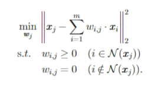
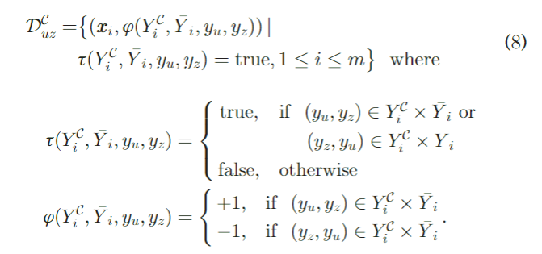
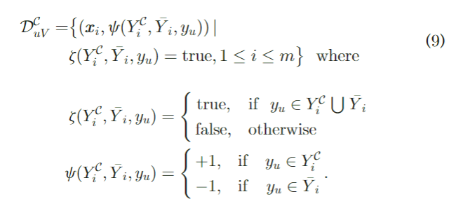
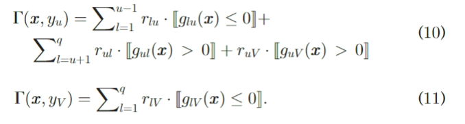
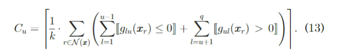
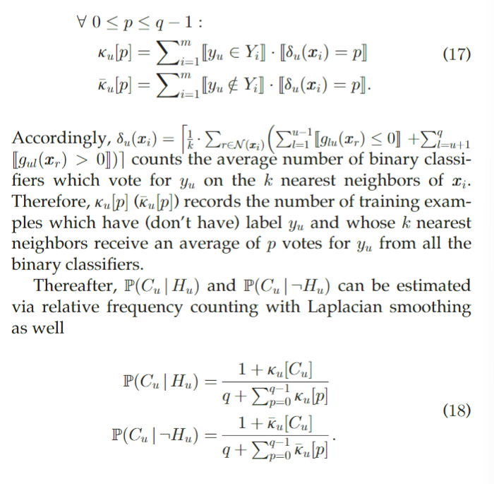

# Partial Multi-Label Learning via Credible Label Elicitation

## 介绍背景

什么是PML？

现有的策略：

1. 从PML训练示例中学习的一个简单策略是将 $Y_i$ 中的所有候选标签视为真实标签，然后使用现成的多标签学习算法诱导多标签预测器。然而，$Y_i$中假正标签带来的标签噪声将显着损害生成的多标签训练过程。

2. 另一种策略是估计每个候选标签是真实标签的置信度，通过 *置信度加权排序损失最小化* 或 *低秩置信度矩阵近似迭代* 来优化置信度得分和预测模型。尽管如此，估计的置信度分数可能容易出错，尤其是当假正标签的比例很高时，由于迭代优化过程，这反过来又会影响预测模型。

本文的方法：

通过 Credible Label Elitation 的偏多标签学习。PARTICLE 的基本思想是通过从候选标签集中引出credible labels，从而减轻假正标签的负面影响，credible labels这将被视为后续模型归纳的可靠标签信息。

简而言之，在第一阶段，通过迭代标签传播去识别具有高标签置信度的credible labels。在第二阶段，通过使用识别的credible labels，通过结合 *虚拟标签分割* 或 *最大后验推理* 的 *成对标签排序* 去诱导多标签预测器。大量的实验结果表明，可信标签的诱导是一种有效的策略，可以解决ground-truth标签隐藏在候选标签集中的主要PML建模困难。

## 相关工作

从概念上讲，部分多标签学习与两个流行的学习框架密切相关，即多标签学习和部分标签学习。

多标签学习(MLL)处理每个样本同时与多个有效标签相关联的问题。现有的MLL方法可以根据用于模型归纳的标签相关性的顺序大致分为三组，包括假设类标签之间的独立性的一阶方法，假设成对标签相关性的二阶方法，以及假设类标签的子集或整个集合之间的标签相关性的高阶方法

部分标签学习(PLL)解决了每个样本与多个候选标签相关联的问题，其中只有一个候选标签是有效的。现有的PLL方法是通过消除候选标签集的歧义或将部分标签学习问题转化为规范的监督学习问题来实现的。PLL和PML共享从噪声训练示例学习的相似设置，其中假阳性标签驻留在候选标签集中。

解决PML建模问题的最直接的策略是将所有候选标签视为真实标签。此后，可以应用任何现成的多标签学习算法来归纳所需的多标签预测器。
另一方面，人们可以选择通过估计每个候选标签作为真实标签的置信度来消除候选标签集的歧义。因此，采用迭代过程通过置信度加权排序损失最小化、低秩置信度矩阵近似或基于二次规划(QP)的判别建模 来交替优化置信度和预测模型。由于优化过程的可选性，置信度分数的估计误差可能会在优化迭代中不断累积，从而损害耦合预测模型，特别是当候选标签集中的假阳性标签比例较高时。

在下一节中，将介绍一种基于可信标签诱导的两阶段偏多标签学习策略，通过利用可靠的标签信息来减轻假阳性标签的负面影响。

## 本文的方法

本文提出的PARTICLE方法包括两个基本阶段：

1. 可信标签诱导阶段
2. 预测模型诱导阶段

***

### 可信标签诱导阶段

在第一阶段，为了从候选标签集中引出可信标签，PARTICLE基于训练实例上的加权图调整标签传播过程。这样，利用特征空间中的结构信息，便于识别标签空间中可靠的标注信息。

给定PML的训练集 $\mathcal D = \{(x_i,Y_i)| 1 \le i \le m \}$ ，一个带权重的有向图 $G = (V,E, \bold{W})$ ，该有向图是基于KNN的最小误差重构的， 这里 $V = \{x_i | 1\le i \le m \}$ 表示训练的实例集， $E = \{(x_i,x_j) | i\in \mathcal N(x_j) , 1\le i \le m \}$  表示有向边，其中 $\mathcal N(x_j)$ 表示 $x_j$ 在 $D$ 中的前 $k$ 个邻近顶点。 $\bold{W} = [w_1 ,w_2, \cdots , w_m]^T$ 表示权重矩阵其中 $w_j = [w_{1,j} , w_{2,j} , \cdots , w_{m,j}]^T (1\le j \le m)$  表示 $x_j$的权重向量

$w_j$ 是由以下最小误差重构问题来进行优化的：

令 $D = diag[d_1,d_2,\cdots , d_m]$ 为对角矩阵，其中 $d_j = \sum^m_{i=1} w_{i,j}$ 。

传播矩阵 $H = WD^{-1}$是通过对 $W$ 的列进行归一化形成的。令 $F = [f_{i,c}]_{m \times q}$ 表示 $m \times q$的矩阵， $f_{i,c} \ge 0$ 表示 $y_c$ 可以成为$x_i$的一个有效标签的置信度。初始的标签置信度矩阵 $F^{(0)}$ 是按照PML训练例子设置的：

$$ \forall 1 \le i \le m :  f^{(0)}_{i,c} = \begin{cases} \frac 1 {|Y_i|}  & if \quad y_c \in Y_i  \\ 0 & otherwise \end{cases}$$

对于第t次迭代， $F$ 是通过当前在$H$上传播的标记置信度来更新的：

$$\hat F^{(t)} = \alpha \cdot \bold H^T \bold F^{(t-1)}  + (1-\alpha) \cdot \bold F^{(0)}$$

$\alpha$ 控制从迭代传播和初始标记置信度 $F$ 中继承的标记信息的比例。然后，PARTICLE通过对候选标记集的每一行进行归一化来将 $\hat F$ 重新缩放为 $F$ 。

$$\forall 1 \le i \le m : f^{(t)}_{i,c} = \begin{cases} \frac {\hat f^{(t)}_{i,c}} {\sum_{y_l \in Y_i} \hat f^{(t)}_{i,l}} & if \quad y_c \in Y_i  \\ 0 & otherwise \end{cases}$$

迭代标签传播过程在 $F$ 不变或达到最大迭代次数（本文中为1000）时终止, 此时得到最终置信度矩阵 $F^*$ 。基于 $F^*$ ，通过识别具有高标记置信度的候选标记，可以为每个PML训练示例引出可信的标记。为了降低标签传播过度拟合的风险，P ARTICLE通过进一步执行kNN聚合： 

给定 $x_j$ 和他的$k$ 邻近 $\mathcal N(x_j)$ ，可以设置一个聚合权重向量 $\omega^j = [\omega^j_1, \omega^j_2, \cdots , \omega^j_m]^T$ ：

$$\forall 1\le i \le m:  \omega^j_i = \begin{cases} 1- \frac {dist(x_i,x_j)} {\sum_{r \in \mathcal N(x_j)} dist(x_r,x_j) }  & if \quad i \in \mathcal N(x_j) \\
0 & otherwise \end{cases}$$

$dist(\cdot , \cdot )$ 表示两个实例之间的欧氏距离，最终生成的标签置信度向量 $\lambda^j = [\lambda^j_1,\lambda^j_2, \cdots, \lambda^j_q]^T$  是通过标签置信度矩阵 $F^*$ 和 聚合权重向量 $\omega^j$ 得到的：

$$\lambda^j = {\bold{F}^*}^T \cdot \omega^j$$

于是 $x_j$ 的可信标签集 $Y^C_j$ 可以通过对 $\lambda^j$ 设置阈值来得到：

$$Y^C_j = \{ y_l | \lambda^j_l \ge thr , y_l \in Y_j \} \bigcup \{y_{l^*} | y_{l^*} = \argmax_{y_l \in Y_j} \lambda^j_l \}$$

即选取置信度超过阈值 thr 的标签并且至少包含候选集中置信度最大的标签。

***

### 预测模型诱导

在第二阶段，利用第一阶段得到的可信标签来建立多标签预测模型。

令$\mathcal D^C = \{(x_i,Y^C_i)| 1\le i \le m\}$ 表示训练集。由成对标签排序得到的结果进一步与虚拟标签分割或最大后验概率(MAP)推理相结合，以完成模型归纳。

对于每一个训练例子 $(x_i , Y^C_i)$ ，令$\bar Y_i = \mathcal Y \setminus Y_i$ 表示 $\mathcal Y$ 中候选标签集 $Y_i$ 的互补集。 ***成对标签排序***的工作原理是将原始学习问题转化为若干个二元学习问题，每个标签对 $(y_u,y_z) (1 \le u < z \le q)$ 对应一个二元学习问题。由 $\mathcal D ^C$ 生成一个二元训练集的方法如下所示:

换句话说，如果$y_u$ 和 $y_z$ 具有不同的分类，对于 $Y^C_i$和$\bar Y_i$，则$x_i$将被用作二元训练示例，否则，$x_i$ 将不参与生成二元训练集$\mathcal D^C_{uz}$。

然后，调用一些二元学习算法 $\mathcal B$ ，可以诱导出 $\dbinom{q}{2}$ 个二元分类器 $g_{uz} : \mathcal X \to \mathbb R$，基于这些二分分类器产生的建模输出，PARTICLE通过虚拟标签分割或者MAP推测来预测不可见示例$x$ 的正确标签集

### 虚拟标签分割

引入一个虚拟标签$y_V$ 作为可信标签和非候选标签之间的一个分割点，那么：

如果$y_u$ 属于 $Y^C_i$ 或者 $\bar Y_i$ 那么就将 $x_i$ 作为一个二元训练实例，否则用于不能构成二元训练集 $\mathcal D^C_{uV}$ 

相应地，会生成 q 个额外的二分分类器 $g_{uV}$。 让 $r_{uz}, r_{uV}$ 分别表示 $g_{uz} $ 和 $g_{uV}$ 在分类$\mathcal D^C_{uz}$  和 $\mathcal D^C_{uV}$ 中的二元示例最后的经验准确度。

所以给定$\dbinom{q}{2} + q$ 个分类器，可以得到对于不可见的实例 $x$，他们在每一个类标签 $y_u$ 以及虚拟标签y_V上的得分为：

 
其中 $[[ \pi ]]$ 返回1 当$\pi$ 成立 ，否则返回0 

最后$x$的预测标签集可以表示为：

$$f(x) = \{ y_u| \Gamma(x,y_u)> \Gamma(x,y_V), 1 \le u \le q\}$$

***

### 最大后验推理

在这种情况下，使用简单的计数统计来实现基于MAP推理的模型预测。对于未见实例$x$，设$C_u$表示统计量，该统计量表示在$\mathcal N(x)$中索引的 $x$ 的 $k$ 个最近邻域上投票给 $y_u$的二分分类器的平均数

令 $H_u$ 表示 $y_u$ 是一个 $x$ 的相关标签的事件，那么

$$f(x) = \{ y_u | P(H_u|C_u) > P(\neg H_U|C_u),1\le u \le q \}$$

根据贝叶斯公式

$$\frac {P(H_u|C_u)}{P(\neg H_u|C_u)} = \frac {P(H_u) \cdot P(C_u | H_u)}{P(\neg H_u) \cdot P(C_u|\neg H_u)}$$

计算先验概率 $P(H_u)  P(\neg H_u)$ 可以通过频率估计 :

$$P(H_u) = \frac {1+ \sum^m_{i=1}[[y_u \in Y_i]]}{2+m}, P(\neg H_u) = 1-P(H_u)$$

而可能性的计算需要引入：

$\delta_u(x_i)$ 统计在$x_i$的k个最近邻域上投票给$y_u$的二元分类器的平均数量。

$\kappa_u[p] （\bar \kappa_u[p]）$ 记录有(没有)标签为$y_u$且它的k个最近邻居从所有二元分类器中为$y_u$投出平均p票的训练示例的数量。

