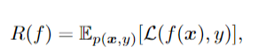
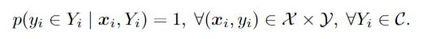
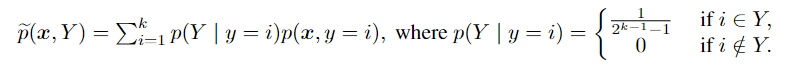
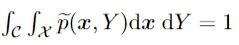
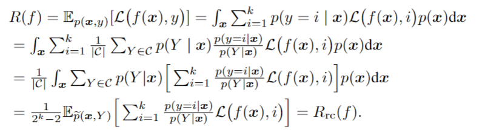

# 论文名： Provably Consistent Partial-Label Learning

摘要：本文提出了候选标签集的第一代模型，并开发了两种保证可证明一致性的新型 PLL 方法，即一种是风险一致（risk-consistent）的，另一种是分类器一致（classifier-consistent）的。

    ambiguity degree：描述正确标签与另一个候选标签的最大同时出现的概率

## 普通标记学习

其中$\mathbb E_p(x,y)[\cdot]$表示对联合概率密度$p(x,y)$的期望，$\mathcal L:\mathbb R^k × \mathcal Y \to \mathbb R_+$是一个多类损失函数，衡量分类器对给定标签的估计效果。

* 分类器一致（classifier-consistent）: 使用该方法训练后的分类器是与最小分类风险 $min_{f \in F} R(f)$ 无限样本一致的。
* 风险一致（risk-consistent）:如果在给定相同分类器 f 的情况下，该方法具有等效于 $ R(f) $ 的分类风险估计量。

**风险一致的方法一定是分类器一致的，而分类器一致未必风险一致**

## 偏标记学习

其中 $\mathcal C  = \{ 2^{\mathcal Y} \backslash \empty \backslash \mathcal Y \}$

PLL的目标是诱导一个多类分类器$f: \mathcal X \to \mathbb R^k$，它能对测试输入做出正确的预测。

## 互补标记学习

互补标记学习是偏标记学习的一种特例，每个互补标记指向类都是非该示例的类。

## 数据生成模型

假设每个偏标记的示例(x，Y)独立地从具有以下密度的概率分布中提取：

该公式描述在给定特定标签的情况下，每个候选标签集被均匀抽样的概率。论文通过下面的定理证明其设计的数据分布是一个有效的概率分布。 
****

***Theorem 1. 等式  成立***  

***Theorem 2. 对于从公式（2）中假设的数据分布中独立抽样的任何偏标记示例(x, Y)，正确的标签y总是在候选标签集Y中***  
***

## 动机

大量的高质量样本对机器学习或数据挖掘是非常有帮助的。然而，我们的标签编制者通常很难直接为每个实例识别正确的标签，收集一组包含正确标签的候选标签会更容易。
假设有一个标签系统可以从C中对标签集Y进行统一采样。对于每个实例x，该标签系统对标签集Y进行统一采样，并询问标签制造者是否在Y中包含正确的标签y。这些实例遵循与公式(2)相同的分布。

***引理1： 给定任意实例x及其正确标签y，对于从C中均匀采样的未知标签集y，等式 $p(y \in Y | x ) = 1/2 $ 成立***

具体来说，如果我们不知道Y的任何信息，我们可以以偶数概率随机猜测正确的Y是否包含在未知的标签集Y中。

***Theorem 3. 正确标签y包含在Y中的采集数据分布和公式（2）相同，即 $p(x,Y | y \in Y) = \tilde p (x,Y)$ 其中 $\tilde p (x,Y)$ 在公式（2）中定义***  

## 一致性方法
***
### 风险一致方法 RC

采用重要性重加权策略将分类风险R(f)改写为

使用softmax函数在f(x)上从而近似表征$p(y=i | x)$,通过将每个非候选标签的置信度设置为0来进一步修正$p(y=i | x)$

### 分类器一致方法 CC
 
引入转换矩阵Q，用于描述给的普通标签的候选标签集的概率 $Q_{ij} = p(Y = C_j | y = i)  where  C_j \in \mathcal C (j \in [2^k - 2 ])$
